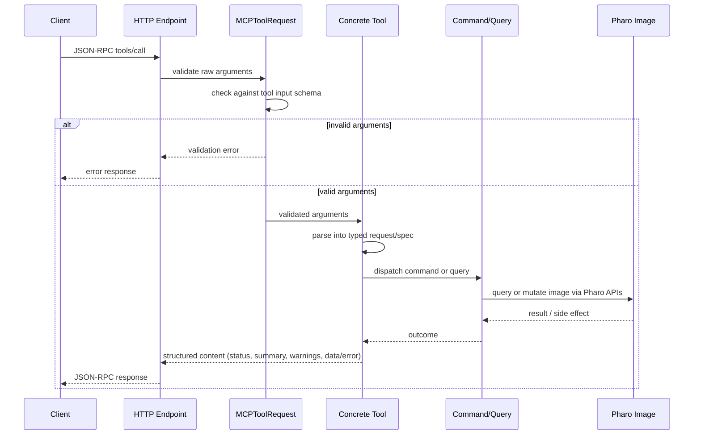

# Safety And Ecosystem Integration

MCP is safest when callers use the dedicated tools before falling back to raw
evaluation. The tools are built around Pharo's normal development systems, so an
agent works through image-aware operations instead of editing exported source
text blindly.

## Tool Boundary

Each tool owns its MCP metadata:

- name and title
- description
- icon
- input JSON schema
- output JSON schema

The execution path is:

1. The HTTP endpoint receives a JSON-RPC `tools/call`.
2. `MCPToolRequest` validates raw arguments against the tool input schema.
3. The concrete tool parses the request into a typed request or spec object.
4. The tool dispatches a command or query object.
5. The command uses Pharo APIs to query or mutate the image.
6. The tool returns a payload with `status`, `summary`, `warnings`, and either
   `data` or `error`. By default this payload is serialized into the MCP
   `content` field; the server can also emit `structuredContent` for clients
   that need programmatic results.



This keeps transport parsing, schema validation, image operations, and result
formatting in separate places.

## Refactorings

Class and method edits use Refactoring Browser and Refactoring Engine operations
where Pharo owns the behavior.

Examples include:

- class rename with `ReRenameClassRefactoring`
- class removal with `ReRemoveClassRefactoring`
- method rename with `ReRenameMethodRefactoring`
- argument add/remove with `RBAddParameterRefactoring` and
  `RBRemoveParameterRefactoring`
- slot add, remove, rename, pull-up, and push-down with the corresponding
  instance-variable refactorings
- method batch removal with `ReRemoveMethodsRefactoring`

When a refactoring raises `RBRefactoringWarning`, the default behavior is to
stop. The tool result includes:

```text
impactMessages
howToProceed
forceSupported: true
```

Review the impact and rerun the same request with `force=true` only when the
warning is acceptable. When forced, the warning messages are returned in the
normal `warnings` array.

## Critiques

`method_compile` compiles method source in the image and returns selected Renraku
critiques in the structured result. It includes error-severity critiques and a
small set of non-error rules that are useful after automated edits, such as
excessive arguments, missing super sends, return in ensure, temporary variable
overrides, and unary accessing methods without returns.

Critiques include:

- Renraku rule class
- title
- description
- source interval when available

The method may compile successfully and still return critiques. Treat critiques
as follow-up review evidence, not as transport failures.

## Rewrite Preview And Confirmation

`method_rewrite` uses Smalltalk AST rewrite rules. Patterns use RB AST pattern
syntax, not regex.

The default mode is preview:

```json
{
  "rules": [
    {
      "lhs": "`@receiver ifTrue: [ `@body ]",
      "rhs": "`@receiver ifTrue: [ `@body ]"
    }
  ],
  "apply": false
}
```

Preview mode returns calculated changes and a `changeSetHash`. Applying requires
the hash from a preview of the same request:

```json
{
  "rules": [
    {
      "lhs": "`@old",
      "rhs": "`@new"
    }
  ],
  "packageNames": ["MyPackage"],
  "apply": true,
  "expectedChangeSetHash": 123456
}
```

Applying to the whole image also requires `force=true`. Prefer an explicit
package, class, hierarchy, or method scope.

## Tests And Coverage

`test_run` runs SUnit classes or individual methods and returns structured test
results. Use `test_coverage_run` when the same test run should collect
CoverageCollector method and node coverage for an explicit method scope.
`test_run` deduplicates concrete test cases across a batch. Use
`selectedTestCount` for selected unique tests, `runCount` for non-skipped
executed tests, and `skippedCount` for skipped tests.

Coverage output includes method counts, node counts, uncovered methods,
partially covered methods, and optional covered method details. Use it after
edits to ask whether the relevant methods were exercised.

## Repository Work

MCP uses Iceberg for repository state. The repository tools can:

- list registered repositories and their branch, head, package, modified, and
  remote metadata
- load Metacello baselines
- create image-side repository registrations or update their metadata,
  including registrations for linked Git worktree checkouts
- inspect `workingCopyDiff`
- verify expected repository identity before edits or exports
- export image changes to Tonel files
- commit, fetch, pull, push, create branches, and switch branches

Use `repository_identity_verify` before edits or exports, and
`repository_change_list` before exporting or committing. Use
`repository_create`, `repository_attach`, and `repository_update` for repository
registration workflows. Export writes image changes to disk and updates the
Iceberg index; it does not stage or commit Git changes.

## Change History

MCP uses Epicea change history. `history_file_list` lists `.ombu`
files, and `history_entry_list` lists entries from the current history
or a selected file. `history_entry_apply` and `history_entry_revert` preview
selected entries, and perform the selected apply or revert only when
`confirm=true`.

Use this when recovering image-side changes or preparing a clean handoff from a
live image back to Tonel/Git.

## Debugging

Debugger tools are discoverable through the `debugging` group. They work with
tracked Pharo `DebugSession` records, captured worker-process exceptions,
SUnit test failures, transient DebugPoint breakpoints, and attached human-opened
debuggers.

Treat debugger state references as opaque and state-scoped. After stepping,
resuming, restarting, terminating, or editing from a debug state, use the newly
returned state before expanding variables or evaluating in a frame again.

Use `debug_method_update` only from a paused debug state and only after reading the
offered repair actions. It uses the same critique gate as method editing before
proceeding a repaired computation.

## Evaluation Escape Hatch

`image_evaluate` runs arbitrary Smalltalk and saves the image after a successful
call. It is useful for short inspection or glue code when no dedicated tool
exists.

Prefer a dedicated tool when one exists, because the dedicated tools validate
input, return structured result data, and often use safer Pharo APIs.

## Observability And UI

The Spec dashboard is available from an inspected `MCP` object. It shows:

- server status and port
- debug mode
- registered tools and descriptions
- observability enabled by default
- per-tool timing metrics
- traces for errors, outliers, and output overruns
- recent logs

Configure `mcp monitoringExportDirectory: aDirectory` to override the default
`~/pharo-mcp-observability` export root for instance metadata,
`logs.jsonl`, `metrics.json`, and `traces.jsonl`.

## Version Compatibility

The baseline loads PharoCompatibility, JRPC, and TinyLogger. CI covers Pharo 12,
13, and 14. Code that depends on version-sensitive Pharo APIs should go through
PharoCompatibility rather than assuming the Pharo 13 API is present everywhere.
